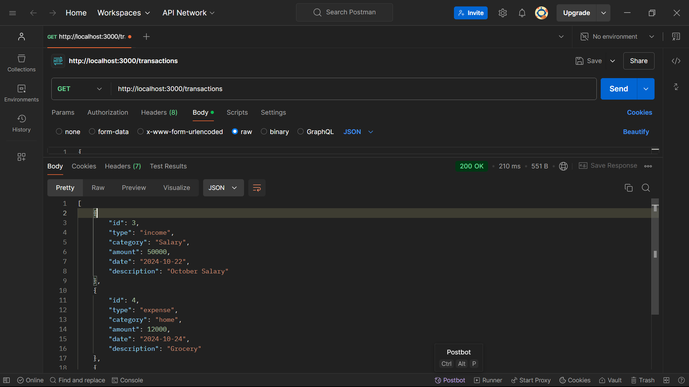

# Personal Expense Tracker
API for managing personal financial records. Users can record their income and expenses, retrieve past transactions, and get summaries by category or time period.

## Technologies Used

1. **Node.js**
2. **SQLite**
3. **Postman (For testing API)**

## SetUp Instructions
1. **Clone the repository**:
   ```bash
   git clone https://github.com/your-username/post-it-app.git
2. **Navigate to the project directory**:
   ```bash
   cd PersonalExpenseTracker
3. **Install the dependencies**:
   ```bash
   npm install

## Running the Application

1. **Start the server**:
    ```bash
    node server.js
2. The server should now be running at: http://localhost:3000 .

## API Endpoints

## API Endpoints

1. **Add new transaction**
   - **URL**: `http://localhost:3000/transactions`
   - **Method**: `POST`
   - **Description**: Adds a new income or expense transaction.
   - **Body Parmeters** :{
                "type": "income/expense",
                "category": "string",
                "amount": "number",
                "date": "YYYY-MM-DD",
                "description": "string"
                }
   - **Response** :{"id": 1,"message": "Transaction added successfully"}
   - 
   
2. **Get all transactions**
   - **URL**: `http://localhost:3000/transactions`
   - **Method**: `GET`
   - **Description**: Retrieves all transactions.
   - **Example Response** :[
                    {
                        "id": 1,
                        "type": "income",
                        "category": "Salary",
                        "amount": 50000,
                        "date": "2024-10-22",
                        "description": "October Salary"
                    }
                    ]
    - 
   
3. **Get transaction by ID**
   - **URL**: `http://localhost:3000/transactions/:id`
   - **Method**: `GET`
   - **Description**: Retrieves a specific transaction by ID.
   - **example Response** :{
                    "id": 1,
                    "type": "income",
                    "category": "Salary",
                    "amount": 50000,
                    "date": "2024-10-22",
                    "description": "October Salary"
                    }
    - 
   
4. **Update a transaction**
   - **URL**: `http://localhost:3000/transactions/:id`
   - **Method**: `PUT`
   - **Description**: Updates a specific transaction by ID.
   - **Body Parmeters** :{
                "type": "income/expense",
                "category": "string",
                "amount": "number",
                "date": "YYYY-MM-DD",
                "description": "string"
                }
   - **Response** :{"message": "Transaction updated successfully"}
   - 

5. **Delete a transaction**
   - **URL**: `http://localhost:3000/transactions/:id`
   - **Method**: `DELETE`
   - **Description**: Deletes a specific
   - **Response** :{"message": "Transaction deleted successfully"}
   - 

6. **Get a summary of transactions**
   - **URL**: `http://localhost:3000/summary`
   - **Method**: `GET`
   - **Description**: Retrieves a summary of total income, total expenses, and balance.
   - **Example Response** :{
                    "total_income": 50000,
                    "total_expense": 5000,
                    "balance": 45000
                    }
    - 

